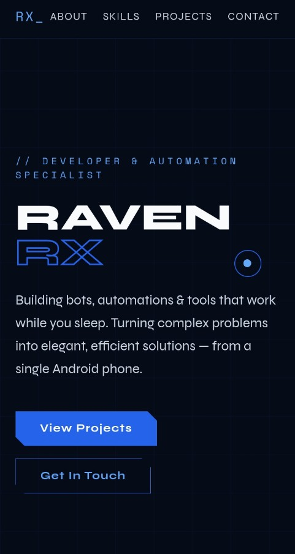

# 🌐 Raven RX — Developer Portfolio

A modern, responsive portfolio website built with pure HTML, CSS, and JavaScript.



## ✨ Features

- Dark theme with blue accent design
- Custom animated cursor
- Smooth scroll reveal animations
- Grid background effect
- Fully responsive (mobile friendly)
- No frameworks — pure HTML/CSS/JS

## 🚀 Live Demo

> [https://RAVENBHAI-81.github.io](https://RAVENBHAI-81.github.io)

## 📁 Structure

```
portfolio/
├── index.html     # Main portfolio file
├── preview.png
└── README.md       # This file
```

## 🛠️ Tech Stack

- HTML5
- CSS3 (Custom Properties, Animations, Grid, Flexbox)
- Vanilla JavaScript (Intersection Observer, Custom Cursor)
- Google Fonts (Space Mono + Syne)

## 📦 Deploy on GitHub Pages

1. Fork or clone this repo
2. Go to **Settings → Pages**
3. Set source to **main branch**
4. Your site will be live at `https://your-username.github.io`

## 📬 Contact

- Telegram: [@RAVENRX](https://t.me/RAVENRX)
- GitHub: [RAVENBHAI-81](https://github.com/RAVENBHAI-81)

---

<p align="center">Made with ❤️ by Raven RX</p>
